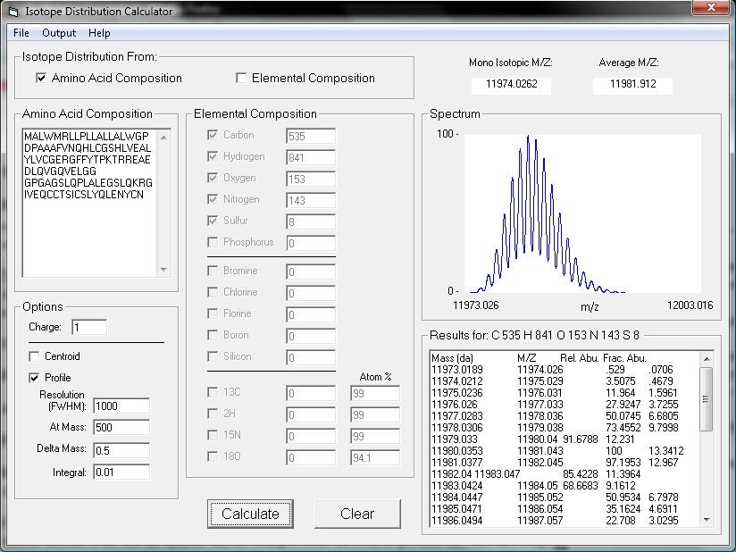

# IDCalc: Isotope Distribution Calculator

Written by Michael J. MacCoss, Department of Genome Sciences, University of Washington

IDCalc was developed to provide a simple way to view the expected isotope distribution  or biological molecules measured by mass spectrometry. The program also includes the the ability to consider enriched stable isotopes. This program was written a long time ago in VB6. At some point it will need to be updated and modernized.

**Input:** Input is either as a peptide sequence or an elemental composition through the graphical user interface.

**User Interface:**

**Algorithm:** The algorithm for predicting the isotope distribution is based on the approach reported by Kubinyi, *Analytica Chimica Acta*, 247 (1991) 107-119. The C, H, O, and N isotope abundances are specific to biological molecules (Dwight E. Matthews personal communication). All other elemental isotope abundances were obtained from Biemann, *Mass Spectrometry, Organic Chemical Applications*, McGraw-Hill New York, 1962, p.59

**Download:** You can get a zip that contains a compiled version and libraries [here](/executable/IDCalc.zip).

**Installation:** In the zip there should be two files.  1) IDCalc.exe and 2) COMDLG32.OCX

Copy the module COMDLG32.OCX and save it to the Windows\System32 or Windows\SysWOW64 folder. On Windows 64-bit systems, copy the OCX file to: C:\Windows\SysWOW64. On Windows 32-bit systems, copy the OCX file to C:\Windows\System32.

You then need to register that library.  From the command line you can do that by typing.

    For Windows 64-bit systems:
    regsvr32  C:\Windows\SysWOW64\COMDLG32.OCX

    For Windows 32-bit systems:
    regsvr32  C:\Windows\System32\COMDLG32.OCX

You should be able to run the program by double clicking on IDCalc.exe